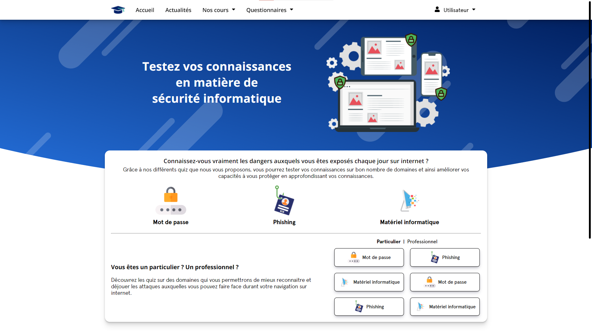

# Workshop EPSI 2021
Création d'un [site web informatif](https://workshop.minarox.fr) visant à améliorer les connaissances en cybersécurité.


## Fonctionnalités
* Actualités concernant le monde de la cybersécurité
* Cours et WiKi
* Questionnaires sur des domaines spécifiques :
  * Possibilité de réponse simple ou multiples selon les questions
  * Description de l'attaque
  * Conseil sur la protection

## Technologie utilisée
* [VueJS](https://vuejs.org/)

## Installation et lancement
Commande d'installation des dépendances nécessaires au bon fonctionnement du site web :
```shell
npm install
```

Exécution du site web :
```shell
npm run serve
```

Compilation pour une mise en production :
```shell
npm run build
```